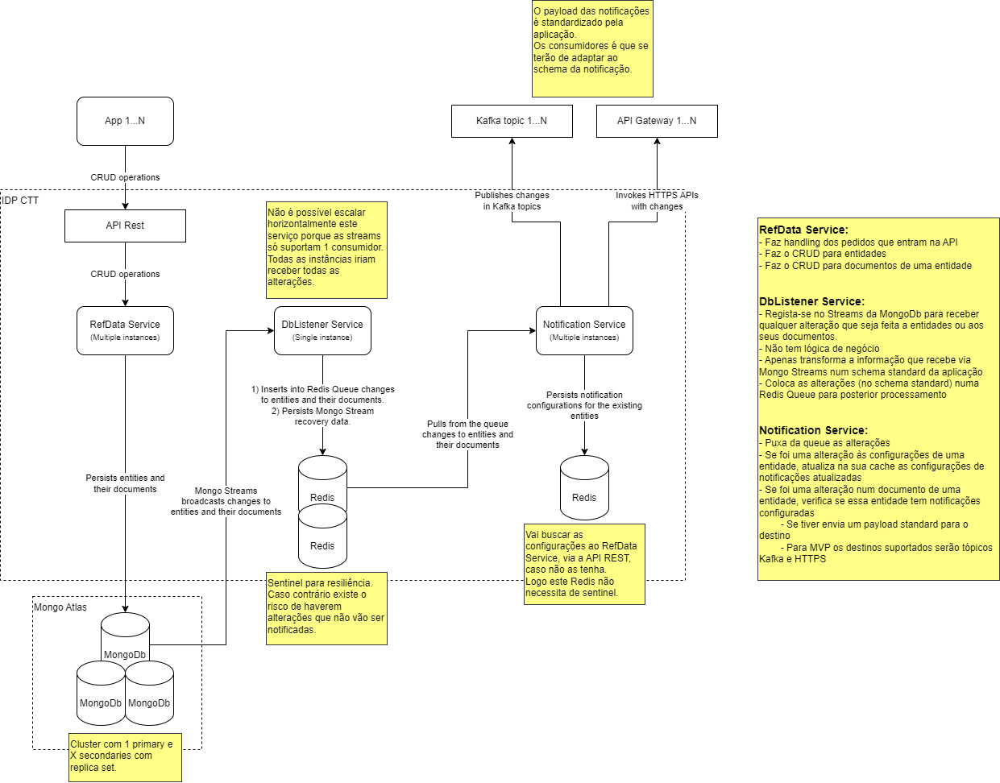

# Your application name
Your application brief description.

## Main functionalities
- View product catalogue
- Add products to shopping cart
- Process payment of products
- Manage customer orders

# Application Architecture


# Technical information
## Stack
This application uses the following technologies:
- React
- Redux
- NginX

# Developer information
## Requisites
To develop in this application you will need, at a minimum, to have installed in your system the following:
- [Docker](https://docs.docker.com/manuals/) with Compose

## Local development environment
This repository contains a local development environment, fully containerised, that can be used to run the application on your machine and test it.

**NOTE:** Use of a unix command line environment is recommended.

### Run the local environment in development mode
To run the local environment, in development mode, follow these steps:

1. From the root of the project run the command
```sh
sh cli/start.sh [flags] [services]
```
Where:

**flags:**<br>
Any flag supported by the `Docker compose up` command.<br>
For more information consult the official Docker [documentation](https://docs.docker.com/reference/cli/docker/compose/up/).<br>
**NOTE:** Consider using the `-d` flag, which runs the Docker project in detached mode.

**services:**<br>
Whitespace separated list of services to run.<br>
The available services are declared in the local environment Docker compose project at `setup/local/docker-compose.yml`.<br>
**NOTE:** If no services are provided, all services will be started.

This will run a Docker compose project and start several networked Docker containers will all the services and necessary tools to use the application.

The following services will be running in the containers:
- List your services here

2. Interact with the local environment via the following URLs:

`Application`: [http://localhost:10000](http://localhost:10000)

### Run the local environment simulating the remote environment
To run the local environment, simulating a remote environment, follow these steps:

1. From the root of the project run the command
```sh
sh cli/start_nginx.sh [flags] [services]
```
Where:

**flags:**<br>
Any flag supported by the `Docker compose up` command.<br>
For more information consult the official Docker [documentation](https://docs.docker.com/reference/cli/docker/compose/up/).<br>
**NOTE:** Consider using the `-d` flag, which runs the Docker project in detached mode.

**services:**<br>
Whitespace separated list of services to run.<br>
The available services are declared in the local environment Docker compose project at `setup/local/docker-compose.nginx.yml`.<br>
**NOTE:** If no services are provided, all services will be started.

This will run a Docker compose project and start several networked Docker containers will all the services and necessary tools to use the application.

The following services will be running in the containers:
- NginX server

2. Interact with the local environment via the following URLs:

`Application`: [http://localhost:10000](http://localhost:10000)

### Stop the local environment
From the root of the project run the command
```sh
sh cli/stop.sh
```
This will stop the Docker compose project and cleanup its resources.

### Configure the local environment
To configure some of the parameters of the local environment follow these steps:

1. Copy the file `setup/local/.env.template` to `setup/local/.env`
2. Fill in the parameters you want to overwrite and delete the ones you want to keep the defaults
3. Run the local environment

## Testing the application
From the root of the project run the command
```sh
sh cli/test.sh [flags] [projects]
```
Where:

**flags:**
- `-w`: Run the tests in watch mode (Requires at least 1 project to be specified)
- `--unit`: Run only unit tests
- `--integration`: Run only integration tests
- `--e2e`: Run only end to end tests
- `--docker`: Run the tests in a Docker container
- `--filter`: Run only the tests that match the provided pattern (Ex: `test/unit` will run only the tests that are inside the this path)
- `--coverage`: Run the unit tests with coverage report

**projects:**<br>
Whitespace separated list of test paths to run.

**NOTES:**<br>
- When running the tests with the flags `--docker` or `--cicd`, the tests will run inside a Docker container that will be in the `myapp_shared` network.
- When running the script with the flags `--integration` or `--e2e` the flag `--docker` is assumed as well, which means the tests will run inside a Docker container.

### Generating test coverage reports
To generate unit test coverage reports, including an HTML report, from the root of the project run the command
```sh
sh cli/coverage.sh [flags]
```
Where:

**flags:**
- `--docker` Build the coverage report in a Docker container

The HTML coverage report is located inside the directory `./coverageReport`, which contains an `index.html` file.

## Project dependencies update validations
To check for updates to the project dependencies and update them if needed, from the root of the project run the command
```sh
sh cli/dependencies_update.sh [flags]
```
Where:

**flags:**
- `-u` | `--update`: Update all outdated dependencies. You will be prompted for each one for confirmation before updating
- `-y`: Update all dependencies without prompting
- `--docker` Run the script inside a Docker container

If the update flag is not provided, the script will print the report with all the dependencies that are outdated, but will not update any of them.

## CI/CD lifecycle
This project uses the reusable pipeline templates for Docker build artifacts located at `https://github.com/PedroHenriques/ci_cd_workflow_templates` and follows the work flow below.


The CI/CD pipeline has the following triggers:

`Pull request`
- `opened`, `edited`, `reopened` and `synchronize` will trigger:
  - CI workflow's static code analysis and automated tests
- `closed` with a merge to the `main` branch will trigger:
  - CI workflow's static code analysis and automated tests
  - CI workflow's build of the Docker images and push to the remote container registry
  - CD workflow's build of the manifest files for the `dev` environment and open a PR on the IDP's dev repo
  - CD workflow's build of the manifest files for the `qua` environment and open a PR on the IDP's qua repo
  - CD workflow's build of the manifest files for the `prd` environment and open a PR on the IDP's prd repo